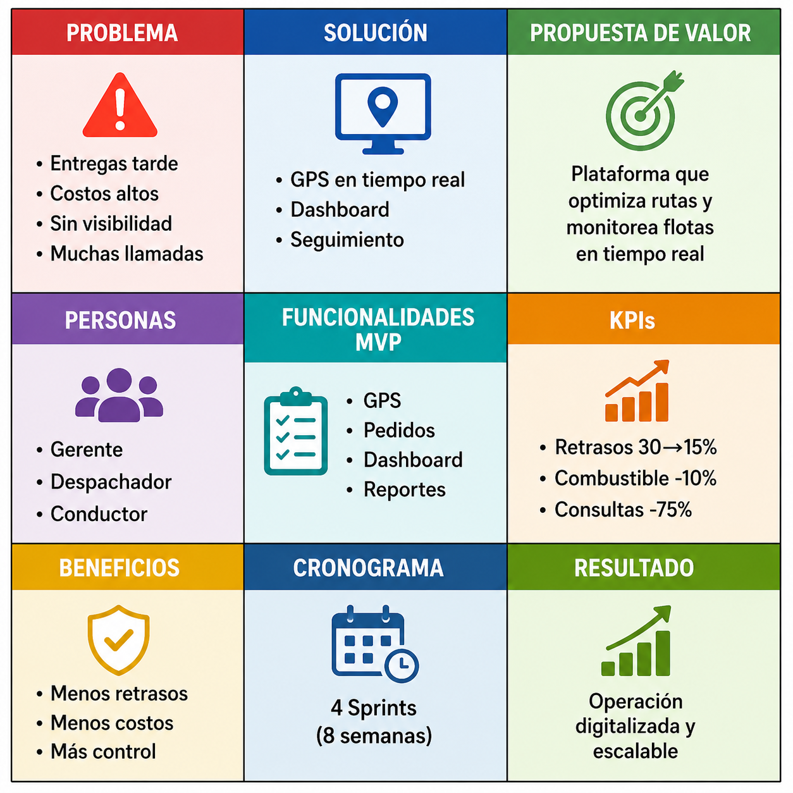

# FlashLogistics

## Canvas MVP

---

## Propuesta de Valor

Plataforma logística que optimiza rutas y monitorea flotas en tiempo real.

## Personas

- Gerente de Operaciones
- Despachador
- Conductor

## Funcionalidades MVP

- Monitoreo GPS en tiempo real
- Gestión de pedidos
- Dashboard operativo
- Reportes de desempeño
- Optimización básica de rutas

## KPIs

- Reducir entregas tardías de 30% a 15%
- Reducir costos de combustible en 10%
- Reducir consultas de clientes en 75%

## Cronograma

| Sprint | Objetivo |
|---------|----------|
| Sprint 1 | Gestión de usuarios y pedidos |
| Sprint 2 | Integración GPS |
| Sprint 3 | Dashboard y seguimiento |
| Sprint 4 | Reportes y optimización |

## Resultado Esperado

Reducir retrasos, mejorar la visibilidad de la flota y digitalizar la operación logística de FlashLogistics.
